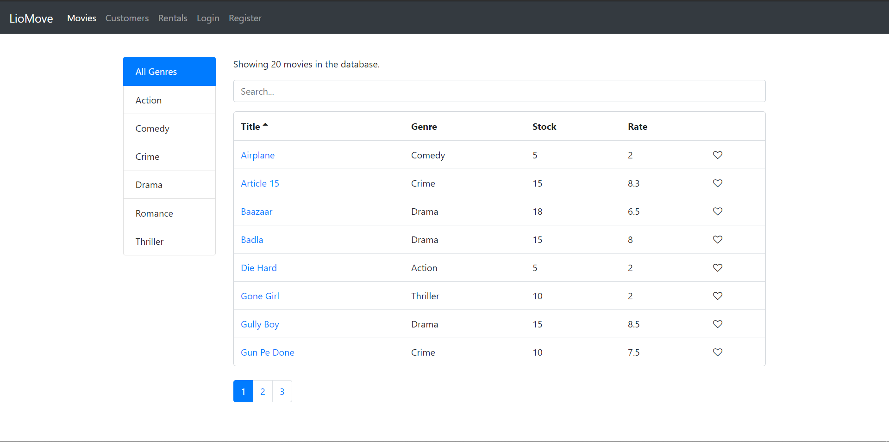
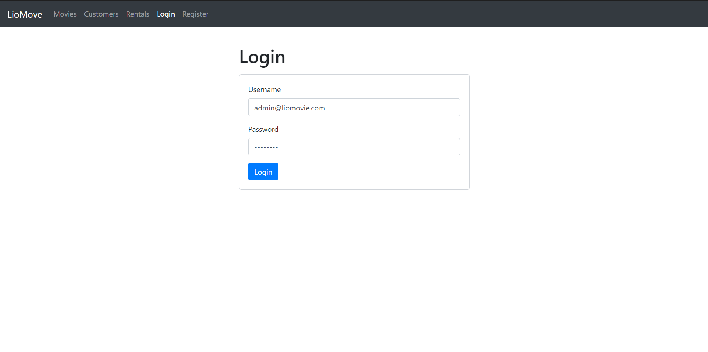
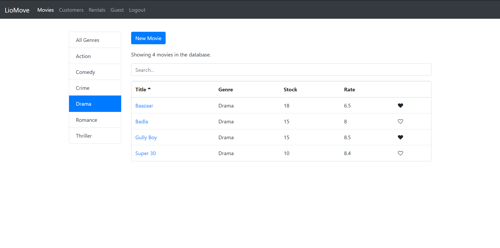

## A movie rental webapp.
It is basically a single page web application to display the movies. I used Node.js as a backend to build the REST full API using express.js, MongoDB and in the frontend, I used a REACT. In this app, we can filter the movie according to the genres and I also added the search option to search the movie while typing. User can register, login and logout. Logged in user can add a new movie and edit the movie details. Only admin can delete the movie from the database.

#### API Link: https://github.com/rynsahu/LioMovie-app-api

### Home page

### Login page

### Register page

### Movie from page

### User page

### Admin page

### Filtering by genre

### Search

